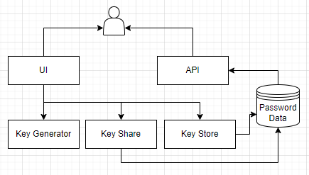

# Key Manager

This service helps the users to secure their keys and share them to other verified sources.

The keys can be accessed through the API.

## Functionality
1. Users can create an account and login
2. Users can store their keys. Each keyset has the following components
   1. Name of the key - a non unique simple identifier for a key
   2. Public Key - Key 1, typically a username
   3. Private Key - Key 2, typically the password
3. Each keyset can be shared to other users
4. Keyset access can be revoked
5. Each keyset can be edited
6. We can set a TTL for each keyset. After the TTL expires, the keyset is revoked
7. A key generator that generates 16 character alphanumberic for user use
8. A CRON job that runs every 24 hours to check for expired keys and revokes them

## Data Schema
1. Keys table - stores the keyset information: name, public key, private key, user id, keyset id, ttl
2. Users table - stores the user information: username, password, user id, email
3. Share table - stores the keyset information: keyset id, user id, shared user id, ttl

## Encryption
1. User keys are encrypted and decrypted through user password hash

## API Endpoints
1. /api/v1/keys - GET, POST, PUT, DELETE: gets all the keys for the user, creates a new keyset, updates a keyset, deletes a keyset - only accessed with key ID
2. /generate - GET: generates a 16 character alphanumeric key
3. /api/v1/share - GET, POST, DELETE: gets all the shared keys for the user, shares a keyset, deletes a shared keyset - only accessed with key ID

## CI/CD
1. GitHub Workflow
2. Docker
3. Travis CI
